# Comparação
## Resultados da classificação x Regras de associação/Estatísticas

### 1. Quantidade de escudos

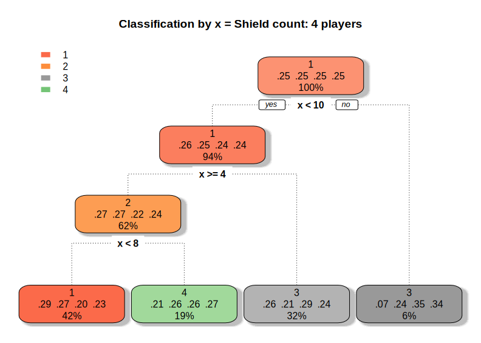
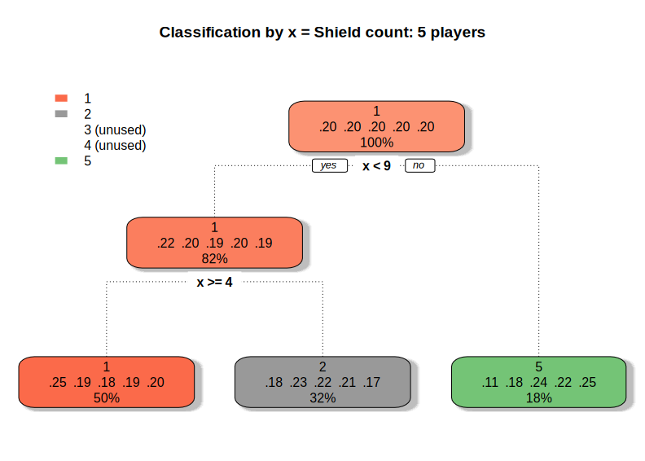
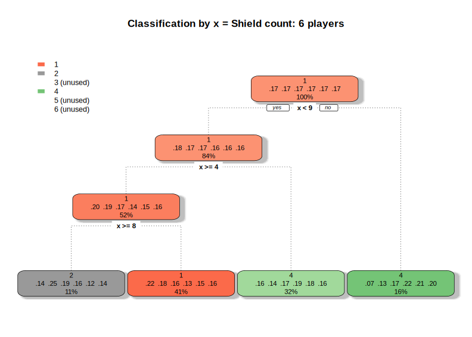
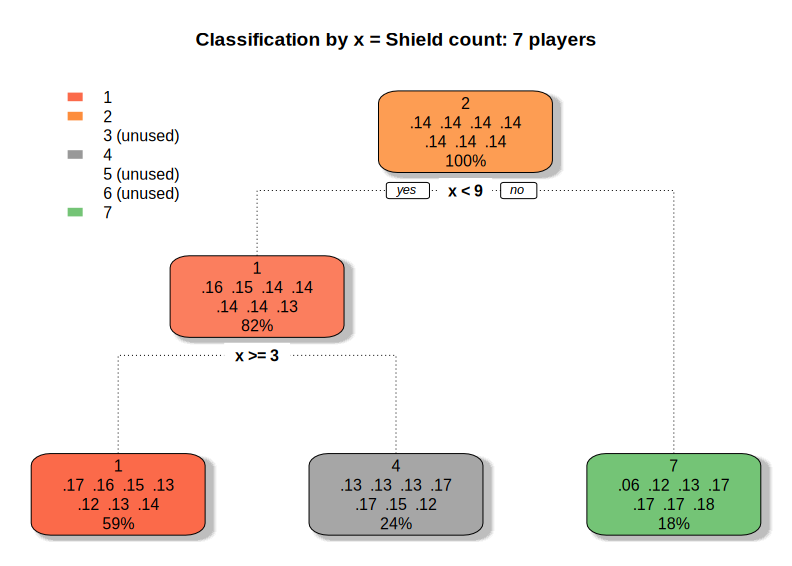

A maior parte dos jogadores vencedores costuma terminar o jogo com
uma boa quantidade de escudos; tipicamente um número maior de 5 e 
menor de 9.

As estatísticas indicam um número de escudos entre 5 e 7 para vencedores,
o que se aproxima dos resultados encontrados na classificação; isso corrobora
com os achados na associação, os quais afirmam que investimentos militares 
auxiliam o jogador a vencer.

### 2. Quantidade de bens manufaturados
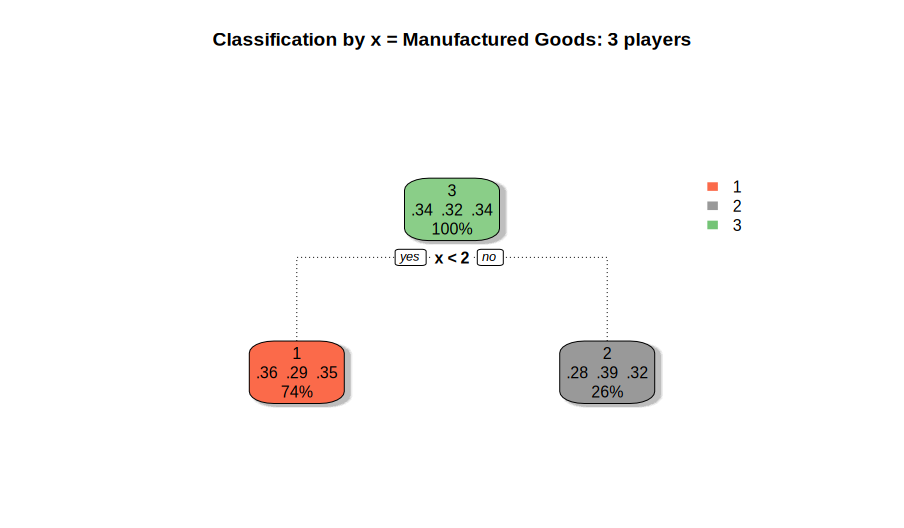
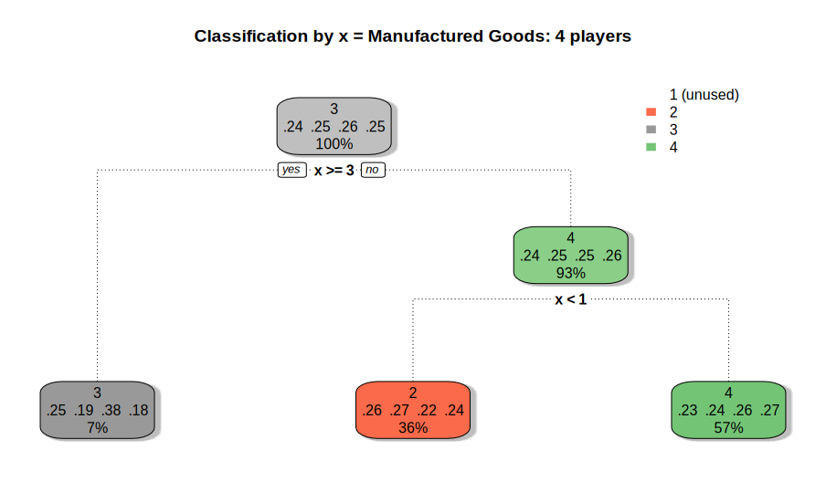
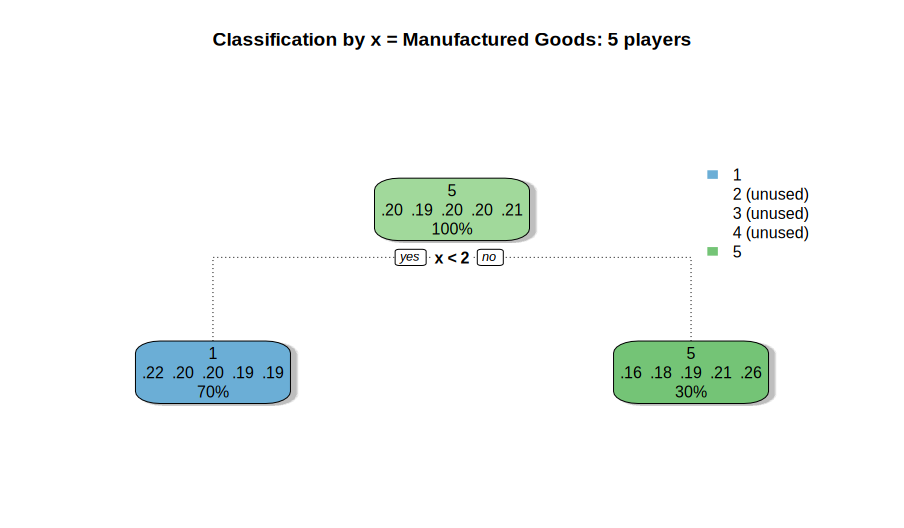
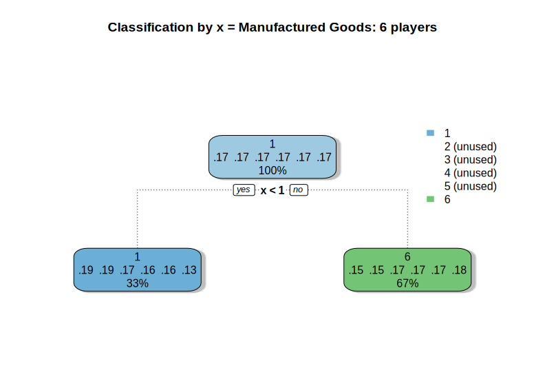
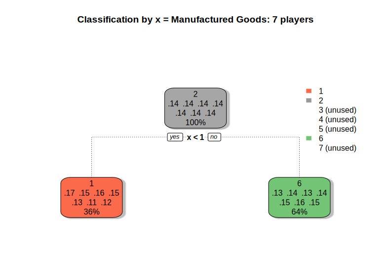

Cartas de bens manufaturados não são tão importantes para jogadores vencedores.
Tipicamente, o vencedor termina tipicamente com 1 bem manufaturado, o que 
vai ao encontro das estatísticas encontradas.

### 3. Quantidade de cartas descartadas
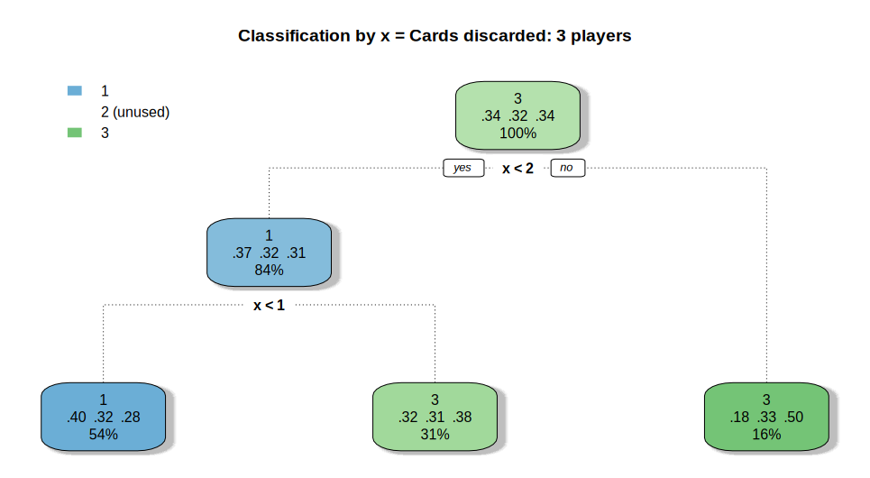
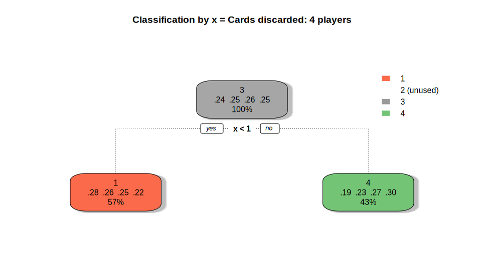
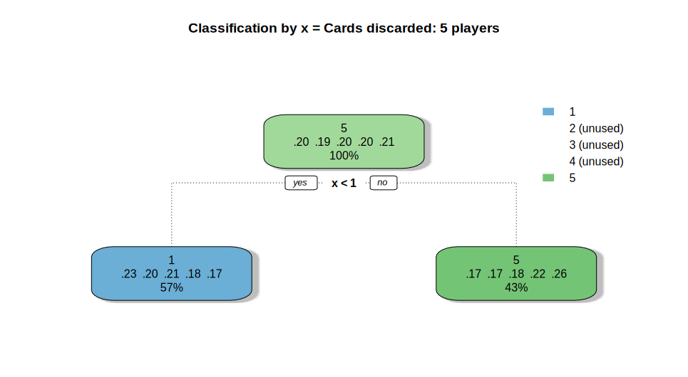
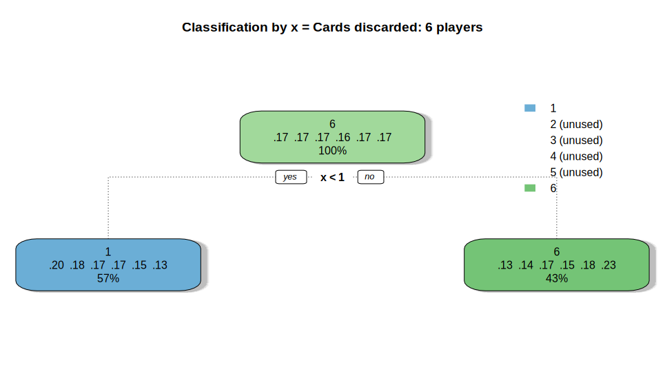
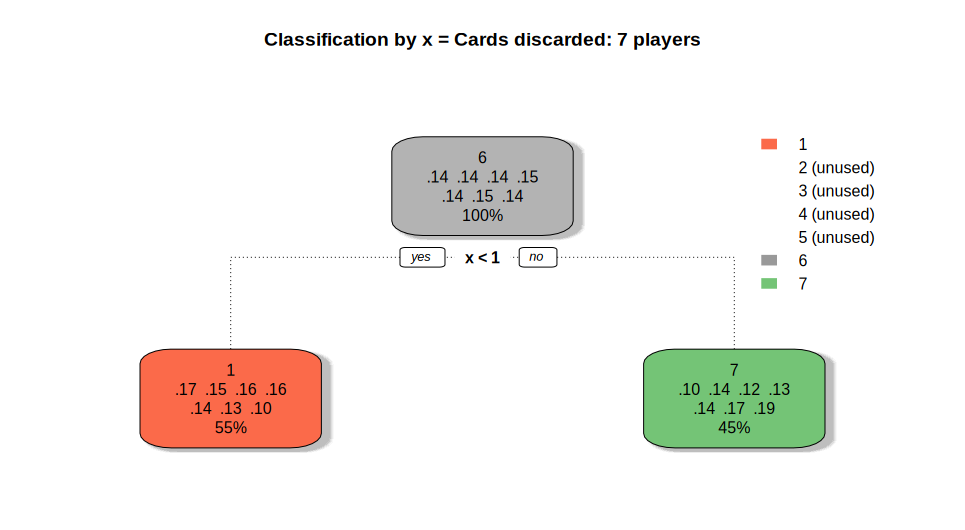

Jogadores vencedores não descartam cartas em troca de moedas, o que também
vai ao encontro das estatísticas encontradas. Quando há descarte, tipicamente
é de apenas 1 carta entre os vencedores.

### 4. Pontos de vitória
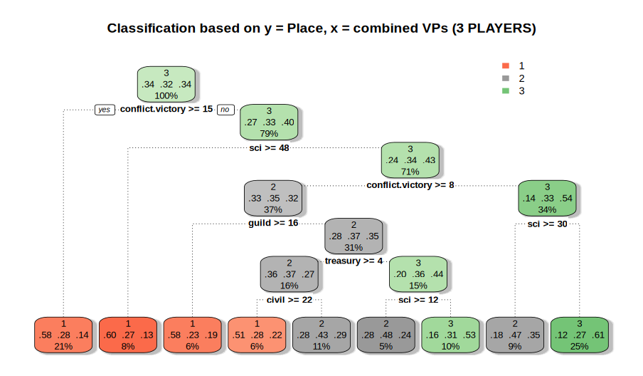
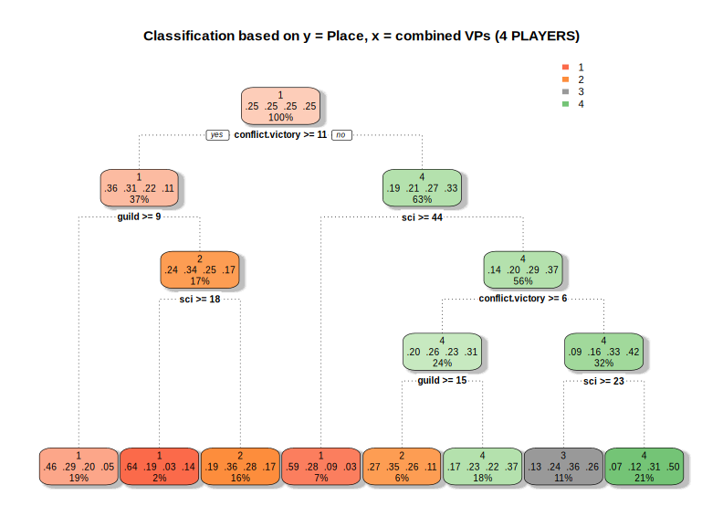
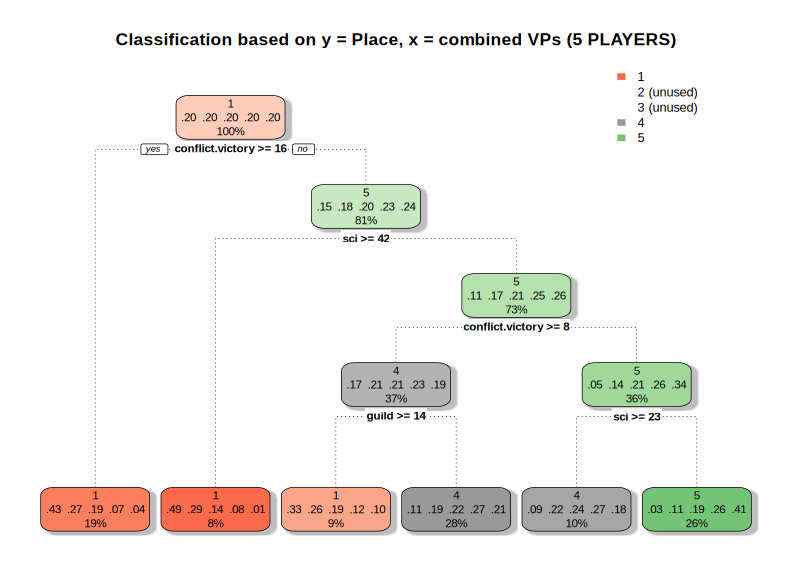
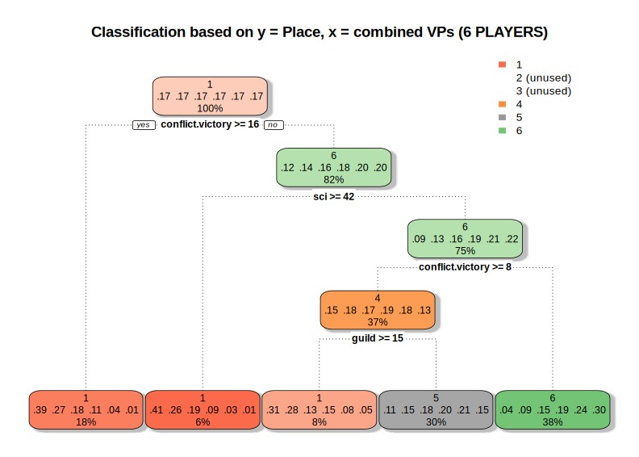

Com as regras de associação anteriormente calculadas, os resultados de
classificação apenas corroboram com o que foi encontrado (juntamente com 
o item #1): jogadores vencedores tipicamente têm um estilo de jogo militarista,
dando foco à coleta de escudos e _tokens_ de vitórias militares.

Com menor importância (mas ainda assim relevantes), tem-se que um bom número de 
pontos de ciência e uma guilda bem escolhida também podem guiar o jogador à vitória.

Outros tipos de pontos de vitória são menos importantes.
